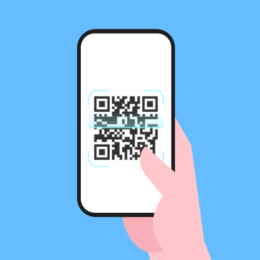
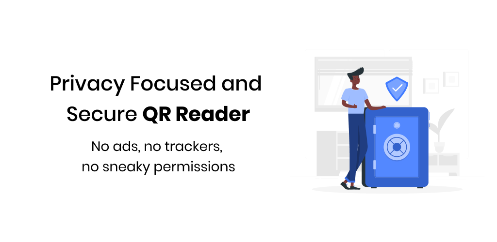
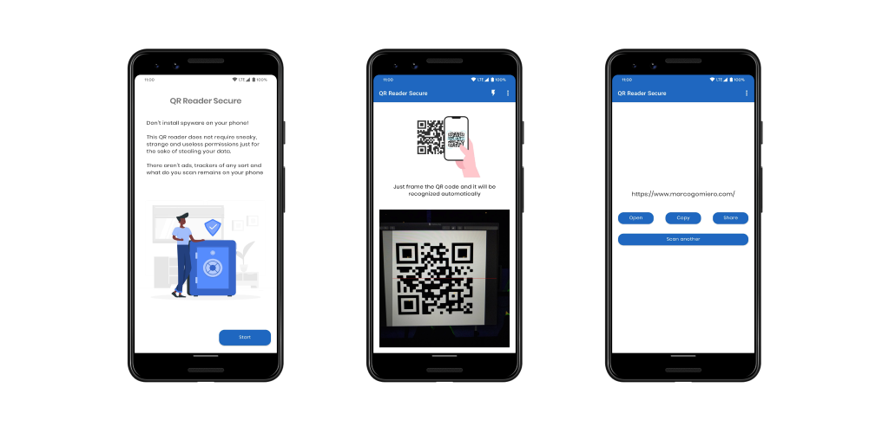

  
  <h1>QR Reader Secure</h1>

QR Reader Secure is a simple QR Reader designed and developed with a focus on privacy.

  

The app is very simple (the aim is to scan a code and open the link, only this!) and it does not require sneaky, strange and useless permissions just for the sake of stealing your data. There aren't ads, trackers of any sort and what do you scan remains on your phone. The only requested permission is for the camera.

  

## Download 📦

You can download QR Reader Secure on the Play Store!

